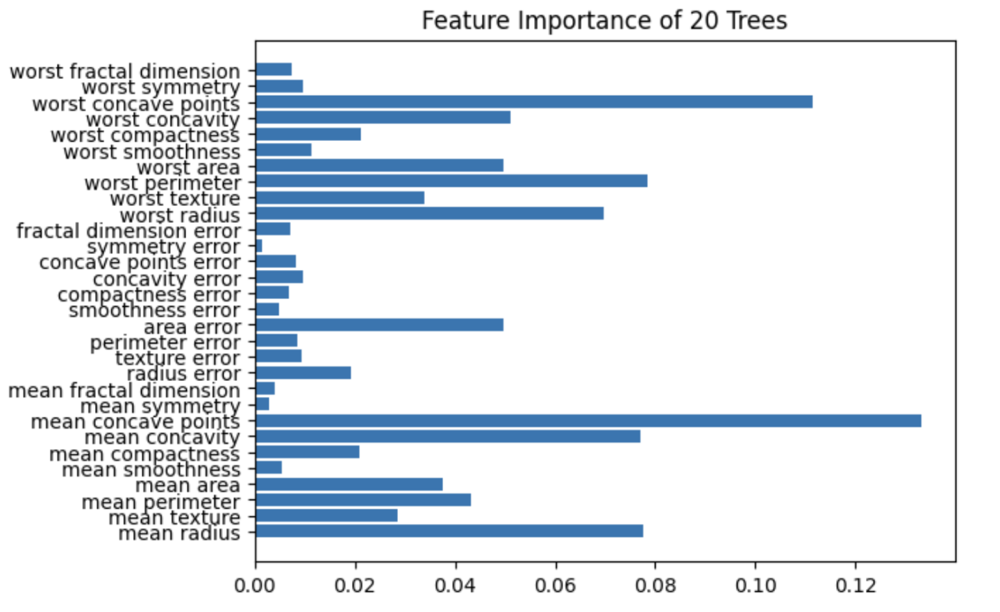
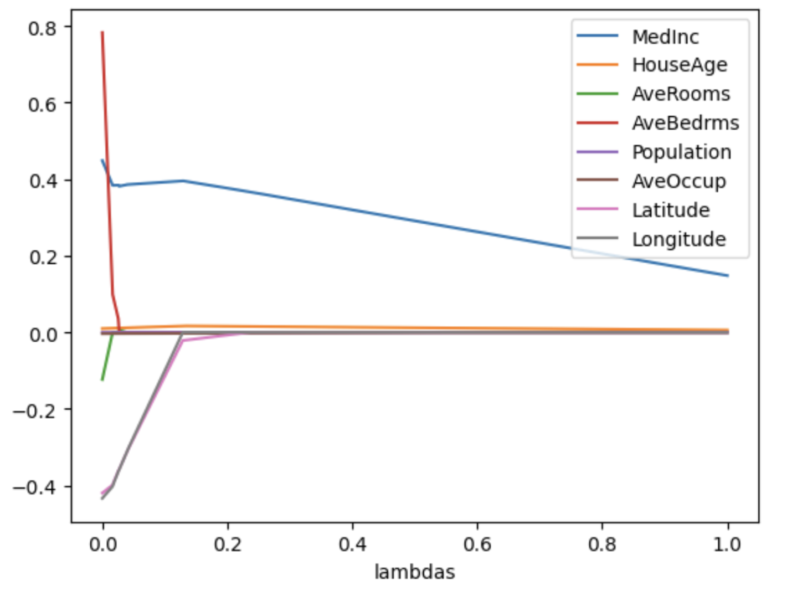

# Logistic Regression

![[Pasted image 20230504105549.png]]
Some features such as petal length and width lend themselves best to logistic regression.

To interpret the coefficients of the logistic regression model, we need to exponentiate a linear model to get the odds ratios. The odds ratio represents the factor by which the odds of the response variable increase with a unit increase in the predictor variable. 

# Decision Tree

The accuracy diminishes after a depth of 3. it has the highest accuracy. the f1 and precision decreases afterwards. The highest performing model does misclassified 4 false positives and correctly classified 110 images. After a depth of 5, our confusion matrix converges to having 1 false positives and 5 false negatives.  

Mean concave points is what contributes most to the decision tree. We observe that feature importance decreases as we go into smaller depths, so we expect the root node to have an over representation. Otherwise, we notice that our model overfits on the training set.

# Random Forest

We notice that for an ensemble of models, that the importance of all features become represented.  

# Regularization 

The coefficients of the linear regression model with different regularization methods do some form of feature selection. We see that the coefficients converge to zero as we increase the $\lambda$ hyperparameter. In fact, $L_1$ goes to actual zero, and $L_2$ goes to converges to zero, but slower. If we wanted to use a single feature to model, we would use median income. latitude and longitude have the second and third most importance on predicting house price. 

